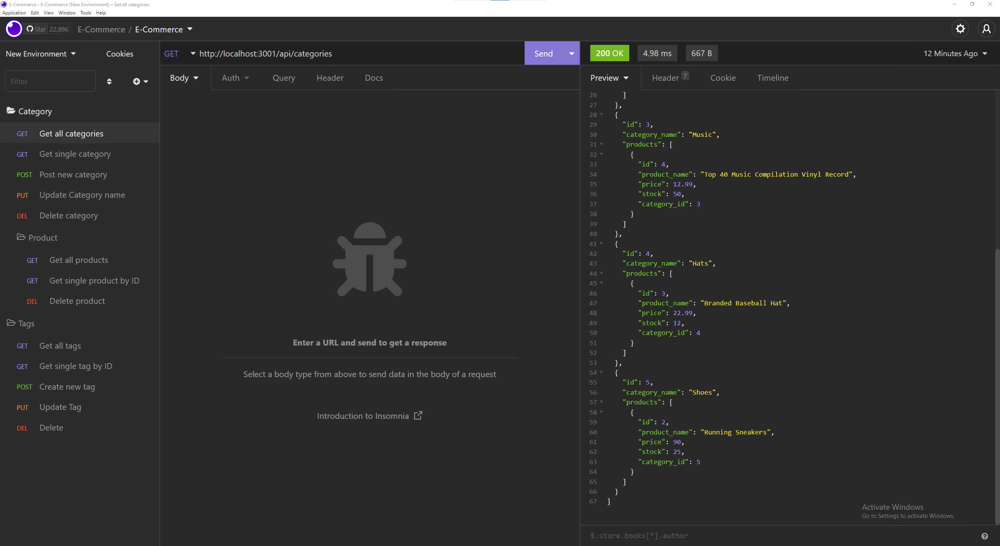

# E-Commerce-Back-End
13 Object-Relational Mapping (ORM)

# E-Commerce-Back-End

## Description
An application that replicates the backend of an e-commerce website which utilizes node, express and sequelize to interact with a MySQL database.

## Table of Contents:
* [Installation](#installation)
* [Usage](#usage)
* [License](#license)
* [Contributing](#contributing)
* [Tests](#tests)
* [Questions](#questions)

## Installation
* Download and clone the repository to your machine
* In the CLI, enter these commands below
    * `npm i` to install dependencies
    * `.env file` <---- Edit file for MySql info
    * `schema.sql` in MySql shell or MySql Workbench
    * `npm run seed` seed database
    * `npm start` to start server

## Usage:
Application Preview

* MySql2
* Sequelize
* dotenv

## License:
This Project is licensed under: MIT

## Contributing:
Fill free to contact me to contribute to this project

## Tests:
No tests at the moment

## Questions:
If there are questions you can reach me via github/email. Listed below
- https://github.com/keeezy
- lazarokev@gmail.com 